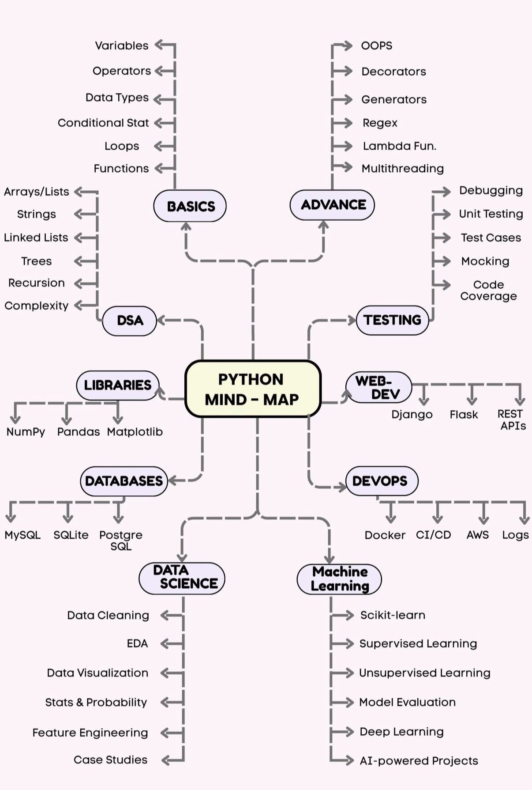

# Python Learning Journey

A structured, hands-on Python learning path — built around real exercises, code reviews, and understanding the **why** behind every concept. Not a tutorial repo — every file here was written from scratch and reviewed for correctness, style, and idiomatic Python.

---

## Learning Path

| Phase | Topics | Status |
|---|---|---|
| 1 | Variables, Data Types, Functions, `*args` / `**kwargs` | Complete |
| 2 | OOP — Classes, Inheritance, `@property` | Complete |
| 3 | Decorators, Generators, Lambda, Regex, Multithreading | In Progress |
| 4 | Testing — pytest, mocking, coverage | Upcoming |
| 5 | Flask deeper + REST API patterns | Upcoming |
| 6 | Databases — psycopg2, SQLAlchemy ORM | Upcoming |
| 7 | DevOps Python — subprocess, Docker SDK, argparse, logging | Upcoming |
| 8 | DSA — Lists, Dicts, Recursion, Big O | Upcoming |
| 9 | Libraries — NumPy, Pandas, Matplotlib | Upcoming |
| 10 | Data Science + ML basics | Upcoming |

---

## Phase 1 — Basics `phase1_basics.py` `phase1_args.py`

### Concepts covered

**Functions & type hints**
- Default arguments (`is_active=True`)
- Return type annotations (`-> str`, `-> list`)
- `**dict` unpacking at call site to pass dict keys as keyword arguments

**Data structures**
- Lists of dicts — the standard pattern for tabular data in Python
- List comprehensions — `[x for x in items if condition]`
- Single-line comprehension handling multiple filter cases: `if item["field"] == param`

**`*args` and `**kwargs`**
- `*args` collects positional arguments into a **tuple**
- `**kwargs` collects keyword arguments into a **dict**
- `*list` at call site unpacks a list into positional arguments
- `**dict` at call site unpacks a dict into keyword arguments
- `enumerate(iterable, start=1)` for clean numbered output

### Key lessons
- Never compare to `False` explicitly — use `not value`
- A function with a branch that returns nothing implicitly returns `None` — always handle all paths
- `*` and `**` have two meanings depending on context: **packing** (definition) vs **unpacking** (call site)

---

## Phase 2 — OOP `phase2_oop.py`

### Concepts covered

**Classes & instances**
- `class Server:` — PascalCase for class names
- `__init__` — constructor; `self` is the instance being built
- Instance attributes (`self.name`) — unique per object, not shared

**Dunder methods**
- `__str__` — controls what `print(obj)` shows

**Inheritance**
- `class DatabaseServer(Server):` — inherits all parent methods
- `super().__init__()` — calls parent constructor; no attribute duplication
- `super().describe()` — extends parent method output instead of rewriting it
- Inherited methods (`decommission()`) work on subclasses without modification

**Encapsulation with `@property`**
- Private attribute convention: `_is_active` (underscore = internal, don't touch directly)
- `@property` getter — computed read access via normal attribute syntax (`server.status`)
- `@status.setter` — validates input before setting; raises `ValueError` for invalid values
- Subclasses access parent state through the public property, not raw `_` attributes

### Key lessons
- Replacing an object is not the same as mutating its state — `@property` demonstrates state change on the same instance
- `super()` prevents duplication and keeps subclasses in sync with parent changes
- Encapsulation means even your own subclass uses the public interface, not `_private` attributes directly

---

## Other files

| File | Description |
|---|---|
| `calculate_radius.py` | Early exercise |
| `reverse_string.py` | Early exercise |
| `temperature_converter.py` | Early exercise |
| `sample_python_tests.py` | Early test exploration |
| `test_program.py` | Early test exploration |

---

## Phase 3 — Advanced Python `phase3_decorators.py` `phase3_generators.py`

### Decorators
- Basic decorator — `log_call` wraps a function with pre/post logging
- `wrapper(*args, **kwargs)` — transparent to any function signature; always `return result`
- Decorator factory — `retry(max_attempts)` accepts arguments via 3-level nesting: `retry` → `decorator` → `wrapper`
- `raise last_error` — re-raises original exception type after all retries exhausted

### Generators
- `yield` — pauses execution, returns one value at a time, resumes where it left off
- `log_stream` — lazy filter over log lines, yields only `ERROR` entries
- `paginate` — chunks a list using `range(0, len, step)` + slice; handles uneven last chunk automatically
- Memory stays constant regardless of input size — no intermediate list built

### Lambda & Comprehensions `phase3_lambda.py`
- `filter()` + lambda — returns filter object; wrap in `list()` to use as list
- `sorted()` + lambda with `key=` and `reverse=True`
- Dict comprehension — `{s["name"]: s["replicas"] for s in services}`
- List comprehension with condition — `[s["name"] for s in services if condition]`
- Rule: use lambda where a callable is required (`key=`, `filter()`); use comprehensions for building collections

### Regex `phase3_regex.py`
- `re.findall()` — all matches as list; `re.search()` — first match anywhere + `.group()`
- Timestamp pattern: `r"\d{4}-\d{2}-\d{2} \d{2}:\d{2}:\d{2}"`
- IP pattern: `r"\d{1,3}\.\d{1,3}\.\d{1,3}\.\d{1,3}"`
- Nested comprehension to flatten per-line results: `[ip for log in logs for ip in re.findall(...)]`
- Use `"text" in string` for literal checks; reserve `re` for actual patterns

### Key lessons
- `@decorator` is syntactic sugar for `func = decorator(func)` — it's just a function call
- Calling a generator returns a generator object; code only runs when iterated
- Decorator factories add one more wrapper layer to accept arguments
- Comprehensions are idiomatic Python; `map()`/`filter()` are functional-style alternatives

---

## Session Notes

Detailed per-session logs (topics, corrections, concepts to carry forward) are in [`Claude-output/`](Claude-output/).
